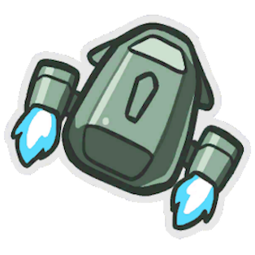

 

  

<h3 align="center">Dropship</h3>
  

    Among us console-app mod launcher 
  

	
	
	
	

## Features
- ✨ Easy to use commands
- ⚙️ Download any version of [Supported Mods](https://github.com/xChipseq/Dropship/blob/main/MODS.md)
- 🚀 Download any **Among Us** version using **built-in DepotDownloader**, no betas required!
- 📖 Create **profiles** and add **mods of your choice** to them without having to manually move the files

## Example Usage
1. Download a mod using `download_mod ModOfYourChoice v1.0.0` command, wait for everything to install
2. Create a new profile with `create_profile MyProfile`
3. Edit it to be able to add mods to it, `edit_profile MyProfile`
4. Add the mod to your profile using `add_mod ModOfYourChoice v1.0.0`
5. Launch the game with `play MyProfile`!

## Instalation
1. Download the [latest release](https://github.com/xChipseq/Dropship/releases/latest). The embedded version is recommended
2. Create a folder for the app and extract the .exe file there
3. Launch the app. This might take a second
4. All the folders should be created, you are all set when you see the dropship text!
> [!Warning]
> While the embedded labeled package has [DepotDownloader](https://github.com/SteamRE/DepotDownloader/releases/latest) installed and should work without any additional work, if you downloaded the other one - `DepotDownloader.exe` is required to download and place in the same folder as `Dropship.exe`

> [!Note]
> For now, the launcher only works with the game bought on **Steam** and the only supported platform is **Windows**. *This will change in future*

## Roadmap
- [ ] Actual UI using WPF (probably)
- [ ] Support for other platforms
- [ ] Support for game bought on apps other than Steam
